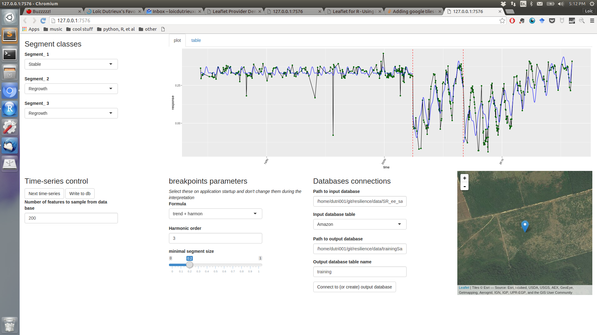

## segmentInterpreter

-----

A shiny utility to interpret segments of a partitioned time-series. The partitioning is done using the `breakpoints` function/algorithm from the [strucchange](https://cran.r-project.org/package=strucchange) R package. The aim of visually interpretting a set of time-series segments is to create a training dataset for automatic classification of the segments into their land dynamics afterwards (using random forest or other classifiers). 

### Dependencies

R packages `spectralResilience`, `shiny`, `stringr`, `RSQLite`.

### Input data

Input data must be a in a sqlite database. The structure of the table should be as follows.
These are extracted individual remote sensing time-series for individual pixels. `B1` to `B7` correspond to the surface reflectance values of these observations, and `sceneID` is the Landsat scene identifier of the scene from which the observation was extracted; it's mostly important to retrieve the date of the observation. 

| index|  B1|   B2|   B3|   B4|   B5|   B7| featureID|       lat|      long|sceneID               |
|-----:|---:|----:|----:|----:|----:|----:|---------:|---------:|---------:|:---------------------|
|     1| 271|  595|  399| 3006| 1585|  603|     11184| -7.714687| -50.01402|LT52230652010104CUB00 |
|     4| 258|  559|  421| 2818| 1571|  608|     11184| -7.714687| -50.01402|LT52230652010136CUB00 |
|     7| 267|  583|  453| 2647| 1615|  647|     11184| -7.714687| -50.01402|LT52230652010184CUB00 |
|    10| 813|  999|  923| 2606| 2074| 1055|     11184| -7.714687| -50.01402|LT52230652010248CUB00 |
|    12| 549|  846|  826| 2796| 2280| 1187|     11184| -7.714687| -50.01402|LT52230652010264CUB00 |
|    14| 694|  966|  924| 2876| 2337| 1333|     11184| -7.714687| -50.01402|LT52230652010280CUB00 |
|    18| 255|  576|  435| 3032| 1758|  697|     11184| -7.714687| -50.01402|LT52230652010344CUB00 |
|    20| 295|  502|  371| 2533| 1360|  498|     11184| -7.714687| -50.01402|LT52230652010360CUB00 |
|    24| 223|  513|  338| 2675| 1554|  634|     11184| -7.714687| -50.01402|LT52230652011155CUB01 |
|    27| 225|  454|  384| 2530| 1510|  609|     11184| -7.714687| -50.01402|LT52230652011187CUB00 |
|    30| 294|  596|  506| 2487| 1761|  829|     11184| -7.714687| -50.01402|LT52230652011219CUB01 |
|    33| 410|  681|  697| 2644| 2083| 1141|     11184| -7.714687| -50.01402|LT52230652011251CUB01 |
|   951| 389|  603|  494| 2061| 1124|  581|     11184| -7.714687| -50.01402|LT52240652010031CUB00 |
|   971| 283|  619|  451| 2742| 1380|  658|     11184| -7.714687| -50.01402|LT52240652010095CUB00 |
|  ... | ...|  ...|  ...|  ...|  ...|  ...|     ...  |      ... | ...      |     ...              |

### Output

The app writes the interpreted segment classes linked to some properties of these segments (mean, phenological amplitude, slope, etc) to a sqlite database. 
